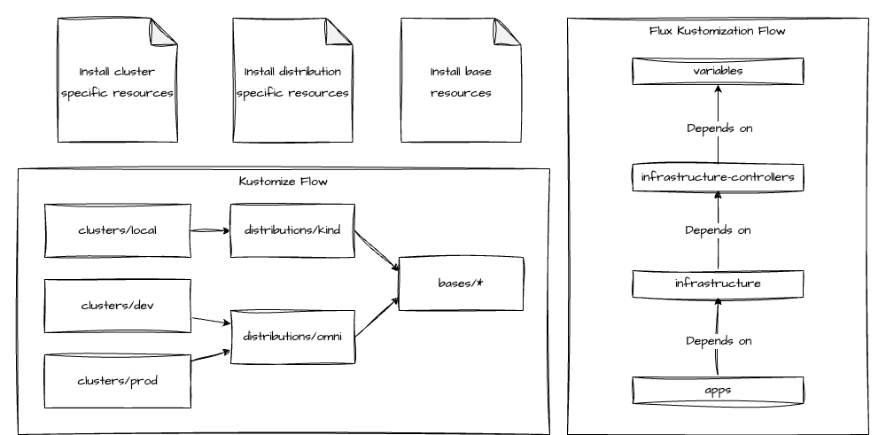

# Welcome to the DevantlerTech Platform ⛴️


This repo contains the deployment artifacts for the DevantlerTech Platform. The platform is a Kubernetes cluster that is highly automated with the use of Flux GitOps, CI/CD with Automated Testing, and much more. Feel free to look around. You might find some inspiration 🙌🏻

## Prerequisites

For local development:

- [Docker](https://docs.docker.com/get-docker/) - For running the cluster locally.
- [KSail](https://github.com/devantler/ksail) - For developing the cluster locally, and for running the cluster in CI to ensure all changes are properly tested before being applied to the production cluster.

For development and production clusters:

- [Hetzner](https://www.hetzner.com/cloud/) - For hosting servers for control plane and worker nodes.
- [Talos Omni](https://www.siderolabs.com/platform/saas-for-kubernetes/) - For provisioning the production cluster, and managing nodes, updates, and the Talos configuration.
- [Cloudflare](https://www.cloudflare.com) - For etcd backups, DNS, and tunneling all traffic so my network stays private.
- [Unifi](https://ui.com/) - For configuring a DMZ zone for my own nodes to run in, along with other security features.
- [UTM](https://mac.getutm.app) - For running Kubernetes on Mac Mini via Apple Hypervisor.
- [Flux GitOps](https://fluxcd.io) - For managing the kubernetes applications and infrastructure declaratively.
- [SOPS](https://getsops.io) and [Age](https://github.com/FiloSottile/age) - For encrypting secrets at rest, allowing me to store them in this repository with confidence.

## Usage

> [!IMPORTANT]
> This setup uses SOPS to encrypt secrets at rest. If you want to run the platform locally, or on your own Omni instance, you will need to:
>
> 1. Fork this repo
> 2. Create your own Age keys
> 3. Update the `.sops.yaml` file in the root of the repository.
> 4. Update GitHub secrets with your Age key.
> 5. Replace all encoded `*.sops.yaml` files in the `k8s/` folder with new ones that are encrypted with your own keys.

To run this cluster locally, simply run:

```bash
ksail up
```

## Clusters

> [!NOTE]
> All clusters use Omni MachineSets, to autoprovision new nodes registered to Omni.

### Production

Hybrid Cloud cluster that runs on both Hetzner Cloud and on-prem. Used for production workloads.

#### Control Plane Nodes

- 3x [Hetzner CAX11 nodes](https://www.hetzner.com/cloud/) (QEMU ARM64 2CPU 4Gb RAM 40Gb SSD)

#### Worker Nodes

- 4x UTM nodes (Apple Hypervisor ARM64 16/20CPU 8/16Gb RAM 55/125Gb SSD)

### Development

Hybrid Cloud cluster that runs on both Hetzner Cloud and on-prem. Used to test and verify workloads before promoting them to production.

#### Control Plane Nodes

- 3x [Hetzner CAX11 nodes](https://www.hetzner.com/cloud/) (QEMU ARM64 2CPU 4Gb RAM 40Gb SSD)

#### Worker Nodes

- 2x UTM nodes (Apple Hypervisor ARM64 16/20CPU 8/16Gb RAM 55/125Gb SSD)

## Hardware

- [Unifi Cloud Gateway](https://eu.store.ui.com/eu/en/pro/products/ucg-ultra)
- 1x Mac Mini M2 Pro (ARM64 10CPU 32Gb RAM ~512Gb SSD)
- 1x Mac Mini M1 (ARM64 8CPU 16Gb RAM ~256Gb SSD)

## Structure

The cluster uses Flux GitOps to reconcile the state of the cluster with single source of truth stored in this repository and published as an OCI image. For development, the cluster is spun up by `KSail` and for production, the cluster is provisioned by `Talos Omni`.

The cluster configuration is stored in the `k8s/*` directories where the structure is as follows:

- [`clusters/`](k8s/clusters): Contains the the cluster specific configuration for each environment.
  - [`local`](k8s/clusters/local): Contains the local cluster specific configuration.
  - [`prod`](k8s/clusters/prod): Contains the production cluster specific configuration.****
- [`distributions/`](k8s/distributions): Contains the distribution specific configuration.
  - [`kind`](k8s/distributions/kind): Contains the kind specific configuration.
  - [`talos`](k8s/distributions/talos): Contains the talos specific configuration.
- [`bases/`](k8s/bases): Contains the different bases that are used for the different clusters and distributions.
  - [`infrastructure`](k8s/bases/common): Contains the different infrastructure components that are used for the different clusters and distributions.
  - [`apps`](k8s/bases/apps): Contains the different apps that are used for the different clusters and distributions.

### Kustomize and Flux Kustomization Flow

> [!IMPORTANT]
> If you know of a different way to manage kustomize and flux kustomizations that results in less boilerplate code, please let me know. I am always looking for ways to improve the structure and make it more maintainable.

To support hooking into the kustomize flow for adding or modifying resources for a specific cluster, a specific distribution, or shared across all clusters, the following structure is used:



This means that for every flux kustomization that is applied to the cluster, there should be a corresponding resource folder in `clusters/<cluster-name>/`, `distributions/<distribution-name>`, or `bases/` that contains resources that should be applied to the cluster for that flux kustomization at the specific scope. For example, for the following flux kustomization `k8s/clusters/<cluster-name>/infrastructure.yaml`, the following resource folders should exist:

- `k8s/clusters/<cluster-name>/infrastructure/`
- `k8s/distributions/<distribution-name>/infrastructure/`
- `k8s/bases/infrastructure/`

This allows for a clean separation of concerns and allows for modification of the resources for a specific cluster, distribution, or shared across all clusters.

## Monthly Cost

| Item               | No. | Per unit | Total in Actual | Total in $ |
| ------------------ | --- | -------- | --------------- | ---------- |
| Talos Omni         | 1   | $10      | $10             | $10        |
| Cloudflare Domains | 3   | $0,87    | $2,61           | $2,61      |
| Hetzner CAX11      | 6   | €4,74    | €28,44          | $32,15     |
|                    |     |          |                 | $44,76     |

## Star History

[](https://star-history.com/#devantler/homelab&Date)
