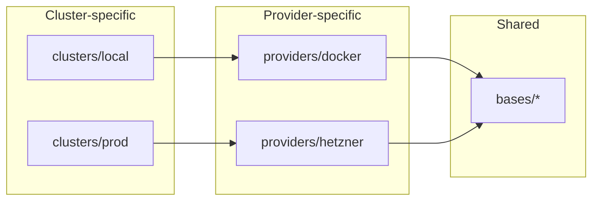
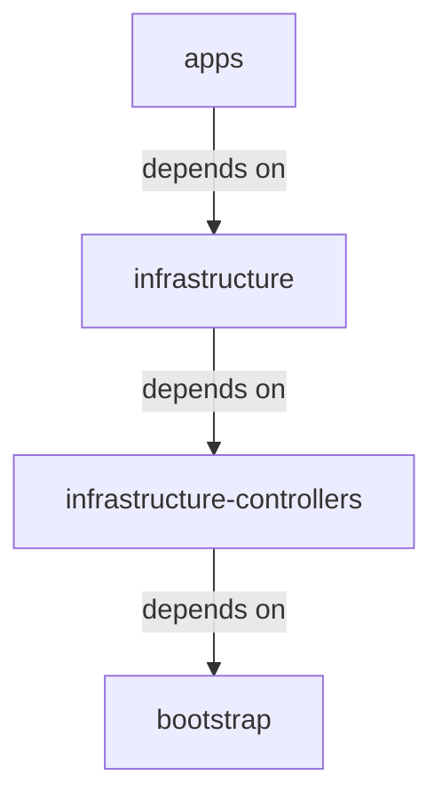

# Devantler Tech Platform ☸️⛴️


My personal Kubernetes platform, in the open. Everything the cluster runs is described as files in
this repository, and changes go live by being merged here rather than by anyone running commands
against the cluster — that pattern is called *GitOps*, and [Flux](https://fluxcd.io) is what applies
it.

This is a working system rather than a product: it is shaped around what I run, and it is not
packaged for reuse. Look around anyway — if you are building something similar, the repository
layout and the guides in [`docs/`](docs) are the useful parts, and
[`docs/TEMPLATING.md`](docs/TEMPLATING.md) lists exactly what a fork has to change. 🙌🏻

## Prerequisites

For local development:

- [Docker](https://docs.docker.com/get-docker/) - For running the cluster locally.
- [KSail](https://github.com/devantler-tech/ksail) - For developing the cluster locally, and for running the cluster in CI to ensure all changes are properly tested before being applied to the production cluster.

For the production cluster:

- [Hetzner Cloud](https://www.hetzner.com/cloud/) — Infrastructure provider and managed Cloud Load Balancer for cluster ingress. KSail's native Hetzner provider handles Talos boot, CCM, CSI, and kubeconfig.
- [Cloudflare](https://www.cloudflare.com) — DNS (A/AAAA records pointed at the Hetzner Cloud Load Balancer) and Origin CA.
- [Flux GitOps](https://fluxcd.io) - For managing the kubernetes applications and infrastructure declaratively.
- [SOPS](https://getsops.io) and [Age](https://github.com/FiloSottile/age) — encrypt the starting
  secrets that are committed here (the `*.enc.yaml` files), so they can live in Git safely.
- [OpenBao](https://openbao.org) and the [External Secrets Operator](https://external-secrets.io) —
  where secrets live once the cluster is running. At startup the encrypted files above are loaded
  into OpenBao, and the operator copies each secret into the namespace that needs it. Two of them
  (Dex and oauth2-proxy) are still read straight from the encrypted files while that move finishes.
  Full picture: [`docs/secret-rotation.md`](docs/secret-rotation.md).

## Usage

> [!IMPORTANT]
> Secrets committed to this repo are encrypted at rest with SOPS + Age. At bootstrap they seed OpenBao, and the External Secrets Operator distributes most of them to workloads at runtime; a few (Dex, oauth2-proxy) are still injected directly via Flux `postBuild` substitution while the OpenBao migration completes. If you want to run the platform locally, or in your own Hetzner project, you will need to:
>
> 1. Fork this repo
> 2. Create your own Age keys
> 3. Update the `.sops.yaml` file in the root of the repository.
> 4. Update GitHub secrets with your Age key.
> 5. Replace all encrypted `*.enc.yaml` files in the `k8s/` folder with new ones that are encrypted with your own keys.

To run this cluster locally, simply run:

```bash
ksail cluster create
ksail workload push
ksail workload reconcile
```

Ports 80 and 443 are mapped to localhost for you (via `extraPortMappings` in [`ksail.yaml`](ksail.yaml)),
and the [`hosts`](hosts) file points the `*.platform.lan` names at `127.0.0.1` — so deployed services
open in a browser.

The local cluster is a **thin test-bed**: somewhere to try one component before promoting it to
production, not a copy of production. It starts with core infrastructure only — networking and
gateway, DNS, TLS, Flux, policy, autoscaling, secrets, single sign-on, and PostgreSQL.

Everything heavier (observability, backup, runtime security, the VM stack, …) and all apps are
opt-in. Uncomment what you want in these files — each carries a copy-paste template — then re-run
`ksail workload push && ksail workload reconcile`:

- `k8s/providers/docker/infrastructure/controllers/kustomization.yaml`
- `k8s/providers/docker/infrastructure/kustomization.yaml`
- `k8s/providers/docker/apps/kustomization.yaml`

To tear down:

```bash
ksail cluster delete
```

### Validating Changes

Before pushing, validate manifests with schema-aware checks and Flux variable substitution:

```bash
# Validate local cluster manifests (default)
ksail workload validate

# Validate prod cluster manifests
ksail --config ksail.prod.yaml workload validate
```

This is faster than a full cluster test and catches YAML errors, missing fields, and broken kustomize overlays.

## Clusters

### Local

Local development cluster running on Docker via KSail. Uses Talos with the Docker provider. A small, thin manual test-bed (see [Usage](#usage)) — bring up a component, try it, then promote it to prod.

- 1 control-plane node + 1 worker node (Docker containers)
- Config: [`ksail.yaml`](ksail.yaml)

### Production

Cloud cluster running on Hetzner Cloud via KSail's native Hetzner provider. Deployed via `v*` tags through the CD pipeline, and validated in the merge queue via the CI pipeline.

- 3× [Hetzner CX33](https://www.hetzner.com/cloud/) control planes + 3× CX33 static workers + autoscaling (x86 4 vCPU 8GB RAM 80GB SSD each)
- Config: [`ksail.prod.yaml`](ksail.prod.yaml)

## Platform components

A high-level inventory of what Flux reconciles onto the cluster. The manifests live under [`k8s/bases/infrastructure/`](k8s/bases/infrastructure) and [`k8s/bases/apps/`](k8s/bases/apps), with provider-specific pieces (Hetzner CCM/CSI, Longhorn, external-dns, …) under [`k8s/providers/`](k8s/providers). The exact set is overlay-dependent: the Hetzner/prod overlay deploys the full base set described below, while the local (docker) overlay is a thin manual test-bed that ships only the core controllers by default and makes the rest opt-in.

**Infrastructure**

- **GitOps & config** — Flux Operator, Reloader
- **Networking** — Cilium (CNI + Gateway API), CoreDNS, external-dns (Cloudflare), Hetzner CCM (prod)
- **Certificates** — cert-manager, trust-manager, Cloudflare Origin CA issuer
- **Secrets** — OpenBao + External Secrets Operator (runtime), SOPS + Age (at-rest seeds)
- **Identity / SSO** — Dex (OIDC) with oauth2-proxy / auth-proxy; see [`docs/oidc-kubectl.md`](docs/oidc-kubectl.md)
- **Policy & runtime security** — Kyverno, Kubescape, Tetragon; see [`docs/runtime-security.md`](docs/runtime-security.md)
- **Storage** — Longhorn (replicated block/RWX, prod via Hetzner CSI), CloudNativePG (PostgreSQL operator); see [`docs/rwx-storage.md`](docs/rwx-storage.md)
- **Autoscaling** — Cluster Autoscaler (nodes), SIG Descheduler (pod rebalancing + node consolidation), Vertical Pod Autoscaler, KEDA request-rate autoscaling (homepage/umami); see [`docs/node-autoscaling.md`](docs/node-autoscaling.md)
- **Progressive delivery** — Flagger (Gateway API canary deployments with SLO-gated automated rollback, metrics from Coroot); see [`docs/progressive-delivery.md`](docs/progressive-delivery.md)
- **Observability** — Coroot (self-hosted, eBPF: metrics, logs, traces, profiling, service map, SLO alerting), OpenCost (cost); see [`docs/dr/alerting.md`](docs/dr/alerting.md)
- **Backup / DR** — Velero with CloudNativePG backups; see [`docs/dr/`](docs/dr)
- **Virtualization** — KubeVirt + CDI _(local/CI only; disabled on the Hetzner/prod overlay)_
- **Testing** — Testkube _(local/CI only; not deployed to prod)_

**Apps** ([`k8s/bases/apps/`](k8s/bases/apps))

- Homepage (dashboard), Headlamp (Kubernetes UI), Umami (analytics), Actual Budget (budgeting), `whoami` (debug)
- FleetDM (device management) is parked — disabled 2026-06-03; its manifests are retained for re-enabling (see [`k8s/bases/apps/kustomization.yaml`](k8s/bases/apps/kustomization.yaml))
- **Tenants** — apps deployed from their own repositories (`ascoachingogvaner`, `wedding-app`); see [`docs/TENANTS.md`](docs/TENANTS.md)

## Structure

The cluster uses Flux GitOps to reconcile the state of the cluster with the single source of truth stored in this repository and published as an OCI image. KSail is used for local development, CI/CD testing, and production deployments. For prod, nodes are provisioned on Hetzner Cloud by KSail's native Hetzner provider, which also installs the Hetzner CCM and CSI drivers.

All environments use the Talos Kubernetes distribution. Local development and CI use Talos with the Docker provider; prod uses Talos with the Hetzner provider.

The cluster configuration is stored in the `k8s/*` directories where the structure is as follows:

- [`clusters/`](k8s/clusters): Contains the cluster specific configuration for each environment.
  - [`base`](k8s/clusters/base): Contains the shared Flux Kustomizations with sentinel paths (`__CLUSTER__`, `__PROVIDER__`).
  - [`local`](k8s/clusters/local): Contains the local cluster specific configuration.
  - [`prod`](k8s/clusters/prod): Contains the production cluster specific configuration.
- [`providers/`](k8s/providers): Contains the provider specific configuration.
  - [`docker`](k8s/providers/docker): Contains the Talos+Docker specific configuration for local development.
  - [`hetzner`](k8s/providers/hetzner): Contains the Talos+Hetzner specific configuration for production.
- [`bases/`](k8s/bases): Contains the different bases that are used for the different clusters and providers.
  - [`infrastructure`](k8s/bases/infrastructure): Contains the different infrastructure components that are used for the different clusters and providers.
  - [`apps`](k8s/bases/apps): Contains the different apps that are used for the different clusters and providers.
  - [`bootstrap`](k8s/bases/bootstrap): The foundational **bootstrap layer** (renamed from `variables/`). Holds the shared substitution variables (`variables-base` ConfigMap + SOPS-encrypted Secret) and cluster-scoped PriorityClasses (e.g. `platform-critical`), reconciled by the `bootstrap` Flux Kustomization before everything that `dependsOn` it.

### How the layers fit together

Two things stack up. First, each environment points at a provider, which patches the shared
resources — so a change can be made for one cluster, for one provider, or for everything at once:


```mermaid
graph LR
  subgraph "Cluster-specific"
    local["clusters/local"]
    prod["clusters/prod"]
  end

  subgraph "Provider-specific"
    docker["providers/docker"]
    hetzner["providers/hetzner"]
  end

  subgraph "Shared"
    bases["bases/*"]
  end

  local --> docker
  prod --> hetzner
  docker --> bases
  hetzner --> bases
```

Second, Flux applies those layers in order, each waiting for the one before it to come up:


```mermaid
graph TB
  bootstrap["bootstrap"]
  controllers["infrastructure-controllers"]
  infra["infrastructure"]
  apps["apps"]

  controllers -- "depends on" --> bootstrap
  infra -- "depends on" --> controllers
  apps -- "depends on" --> infra
```

Each layer in that chain has a matching folder under `providers/<provider-name>/` and `bases/`. The
`infrastructure` layer, for example, is backed by `k8s/providers/<provider-name>/infrastructure/` and
`k8s/bases/infrastructure/`.

The layer definitions themselves are written once in `k8s/clusters/base/` with placeholders where the
cluster and provider names go; each cluster's overlay fills those in. Only the per-cluster
`bootstrap/` directory holds manifests unique to one cluster.

- [`docs/TEMPLATING.md`](docs/TEMPLATING.md) — the exact files a fork must edit, including how those
  placeholders get filled in.
- [`docs/TENANTS.md`](docs/TENANTS.md) — adding a **tenant**: an app that runs on the platform from
  its own repository.

## Documentation

Deeper guides and design notes live in [`docs/`](docs):

- [`TEMPLATING.md`](docs/TEMPLATING.md) — the exact set of files a fork needs to edit to stand up its own instance.
- [`TENANTS.md`](docs/TENANTS.md) — onboarding a new GitOps tenant (an app that runs on the platform from its own repository).
- [`node-autoscaling.md`](docs/node-autoscaling.md) — how the Cluster Autoscaler is configured on Hetzner.
- [`oidc-kubectl.md`](docs/oidc-kubectl.md) — authenticating `kubectl` against the cluster via OIDC.
- [`progressive-delivery.md`](docs/progressive-delivery.md) — Flagger Gateway API canary deployments and the per-app onboarding recipe.
- [`runtime-security.md`](docs/runtime-security.md) — Tetragon runtime security.
- [`rwx-storage.md`](docs/rwx-storage.md) — Longhorn replicated / RWX storage.
- [`secret-rotation.md`](docs/secret-rotation.md) — the secrets architecture (SOPS → OpenBao → External Secrets) and rotation design.
- [`dr/`](docs/dr) — disaster-recovery runbooks (backup/restore drills, OpenBao crypto custody, Velero + CloudNativePG, alerting).

## Monthly Cost

> [!NOTE]
> Prices are approximate and may be outdated.

| Item                      | No. | Per unit | Total in Actual | Total in $ |
| ------------------------- | --- | -------- | --------------- | ---------- |
| Cloudflare Domains        | 2   | $0,87    | $1,74           | $1,74      |
| Hetzner CX33 (prod)       | 6   | €6,49    | €38,94          | $44,21     |
| Hetzner Cloud LB LB11 (prod) | 1 | €5,39   | €5,39           | $6,12      |
| Total                     |     |          |                 | $52,07     |

## Star History

[](https://star-history.com/#devantler-tech/platform&Date)
