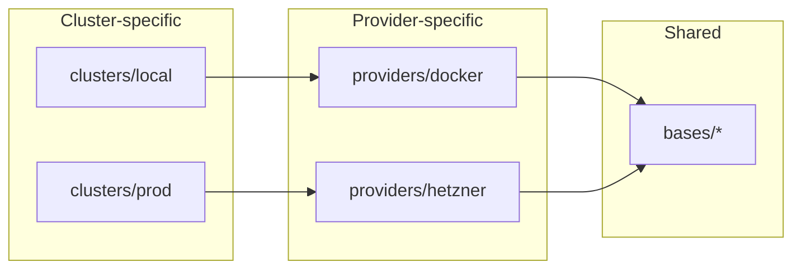
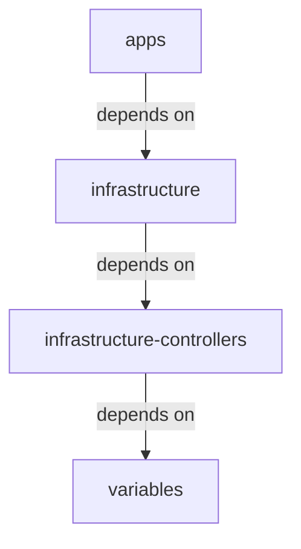

# DevantlerTech Platform ☸️⛴️


This repo contains the deployment artifacts for the DevantlerTech Platform. The platform is a Kubernetes cluster that is highly automated with the use of Flux GitOps, CI/CD with Automated Testing, and much more. Feel free to look around. You might find some inspiration 🙌🏻

## Prerequisites

For local development:

- [Docker](https://docs.docker.com/get-docker/) - For running the cluster locally.
- [KSail](https://github.com/devantler-tech/ksail) - For developing the cluster locally, and for running the cluster in CI to ensure all changes are properly tested before being applied to the production cluster.

For the production cluster:

- [Hetzner Cloud](https://www.hetzner.com/cloud/) — Infrastructure provider and managed Cloud Load Balancer for cluster ingress. KSail's native Hetzner provider handles Talos boot, CCM, CSI, and kubeconfig.
- [Cloudflare](https://www.cloudflare.com) — DNS (A/AAAA records pointed at the Hetzner Cloud Load Balancer) and Origin CA.
- [Flux GitOps](https://fluxcd.io) - For managing the kubernetes applications and infrastructure declaratively.
- [SOPS](https://getsops.io) and [Age](https://github.com/FiloSottile/age) - For encrypting secrets at rest, allowing me to store them in this repository with confidence.

## Usage

> [!IMPORTANT]
> This setup uses SOPS to encrypt secrets at rest. If you want to run the platform locally, or in your own Hetzner project, you will need to:
>
> 1. Fork this repo
> 2. Create your own Age keys
> 3. Update the `.sops.yaml` file in the root of the repository.
> 4. Update GitHub secrets with your Age key.
> 5. Replace all encrypted `*.enc.yaml` files in the `k8s/` folder with new ones that are encrypted with your own keys.

To run this cluster locally, simply run:

```bash
ksail cluster create
ksail workload push
ksail workload reconcile
```

Ports 80 and 443 are automatically mapped to localhost via `extraPortMappings` in `ksail.yaml`. Once the cluster is running, access services at `https://platform.lan` (requires host entries from the `hosts` file).

To tear down:

```bash
ksail cluster delete
```

### Validating Changes

Before pushing, validate manifests with schema-aware checks and Flux variable substitution:

```bash
ksail workload validate
```

This is faster than a full cluster test and catches YAML errors, missing fields, and broken kustomize overlays.

## Clusters

> [!TIP]
> All clusters allow scheduling of workloads on control plane nodes. For homelab purposes, this is fine, but for enterprise use, it is recommended to separate control plane and worker nodes to ensure high availability and reliability.

### Local

Local development cluster running on Docker via KSail. Uses Talos with the Docker provider.

- 1 control-plane node + 3 worker nodes (Docker containers)
- Config: [`ksail.yaml`](ksail.yaml)

### Production

Cloud cluster running on Hetzner Cloud via KSail's native Hetzner provider. Deployed via `v*` tags through the CD pipeline, and validated in the merge queue via the CI pipeline.

- 3× [Hetzner CX23](https://www.hetzner.com/cloud/) control planes + 3× CX23 static workers + autoscaling (x86 2 vCPU 4Gb RAM 40Gb SSD each)
- Config: [`ksail.prod.yaml`](ksail.prod.yaml)

## Structure

The cluster uses Flux GitOps to reconcile the state of the cluster with the single source of truth stored in this repository and published as an OCI image. KSail is used for local development, CI/CD testing, and production deployments. For prod, nodes are provisioned on Hetzner Cloud by KSail's native Hetzner provider, which also installs the Hetzner CCM and CSI drivers.

All environments use the Talos Kubernetes distribution. Local development and CI use Talos with the Docker provider; prod uses Talos with the Hetzner provider.

The cluster configuration is stored in the `k8s/*` directories where the structure is as follows:

- [`clusters/`](k8s/clusters): Contains the cluster specific configuration for each environment.
  - [`local`](k8s/clusters/local): Contains the local cluster specific configuration.
  - [`prod`](k8s/clusters/prod): Contains the production cluster specific configuration.
- [`providers/`](k8s/providers): Contains the provider specific configuration.
  - [`docker`](k8s/providers/docker): Contains the Talos+Docker specific configuration for local development.
  - [`hetzner`](k8s/providers/hetzner): Contains the Talos+Hetzner specific configuration for production.
- [`bases/`](k8s/bases): Contains the different bases that are used for the different clusters and providers.
  - [`cluster`](k8s/bases/cluster): Contains the shared Flux Kustomizations with sentinel paths (`__CLUSTER__`, `__PROVIDER__`).
  - [`infrastructure`](k8s/bases/infrastructure): Contains the different infrastructure components that are used for the different clusters and providers.
  - [`apps`](k8s/bases/apps): Contains the different apps that are used for the different clusters and providers.
  - [`variables`](k8s/bases/variables): Contains the shared base variables (ConfigMap and Secret).

### Kustomize and Flux Kustomization Flow

> [!IMPORTANT]
> If you know of a different way to manage kustomize and flux kustomizations that results in less boilerplate code, please let me know. I am always looking for ways to improve the structure and make it more maintainable.

To support hooking into the kustomize flow for adding or modifying resources for a specific cluster, a specific provider, or shared across all clusters, the following structure is used:

#### Kustomize Overlay Flow

Each cluster environment references a provider overlay, which in turn patches the shared base resources:


```mermaid
graph LR
  subgraph "Cluster-specific"
    local["clusters/local"]
    prod["clusters/prod"]
  end

  subgraph "Provider-specific"
    docker["providers/docker"]
    hetzner["providers/hetzner"]
  end

  subgraph "Shared"
    bases["bases/*"]
  end

  local --> docker
  prod --> hetzner
  docker --> bases
  hetzner --> bases
```

#### Flux Kustomization Dependency Chain

Flux Kustomizations are reconciled sequentially. Each layer waits for the previous to become ready:


```mermaid
graph TB
  variables["variables"]
  controllers["infrastructure-controllers"]
  infra["infrastructure"]
  apps["apps"]

  controllers -- "depends on" --> variables
  infra -- "depends on" --> controllers
  apps -- "depends on" --> infra
```

This means that for every Flux Kustomization applied to a cluster, there should be a corresponding resource folder in `providers/<provider-name>/` or `bases/` that contains the manifests for that scope. For example, the `infrastructure` Flux Kustomization is backed by:

- `k8s/providers/<provider-name>/infrastructure/`
- `k8s/bases/infrastructure/`

The Flux Kustomizations themselves live in `k8s/bases/cluster/` (with sentinel `__CLUSTER__` / `__PROVIDER__` values in `spec.path`). Each `k8s/clusters/<cluster-name>/` overlay supplies a tiny `cluster-meta` ConfigMap and kustomize `replacements:` that rewrite those sentinels with the cluster's real values. Only the per-cluster `variables/` directory holds cluster-specific manifests.

See [`docs/TEMPLATING.md`](docs/TEMPLATING.md) for the exact set of files a fork of this repo needs to edit to stand up its own instance.

## Monthly Cost

> [!NOTE]
> Prices are approximate and may be outdated.

| Item                      | No. | Per unit | Total in Actual | Total in $ |
| ------------------------- | --- | -------- | --------------- | ---------- |
| Cloudflare Domains        | 2   | $0,87    | $1,74           | $1,74      |
| Hetzner CX23 (prod)       | 6   | €4,51    | €27,06          | $30,72     |
| Hetzner Cloud LB LB11 (prod) | 1 | €5,39   | €5,39           | $6,12      |
| Total                     |     |          |                 | $38,58     |

## Star History

[](https://star-history.com/#devantler-tech/platform&Date)
