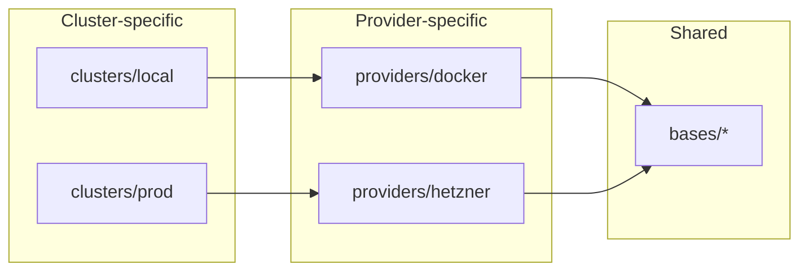
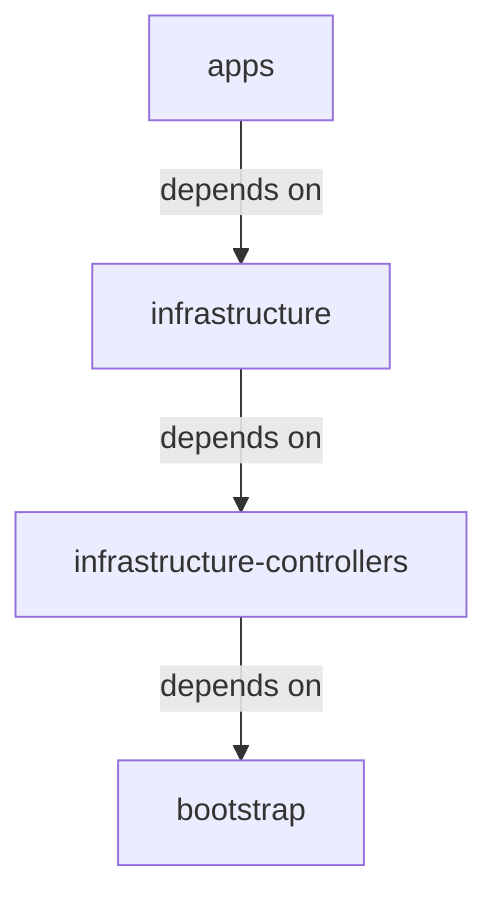

# Devantler Tech Platform ☸️⛴️


This repo contains the deployment artifacts for the DevantlerTech Platform. The platform is a Kubernetes cluster that is highly automated with the use of Flux GitOps, CI/CD with Automated Testing, and much more. Feel free to look around. You might find some inspiration 🙌🏻

## Prerequisites

For local development:

- [Docker](https://docs.docker.com/get-docker/) - For running the cluster locally.
- [KSail](https://github.com/devantler-tech/ksail) - For developing the cluster locally, and for running the cluster in CI to ensure all changes are properly tested before being applied to the production cluster.

For the production cluster:

- [Hetzner Cloud](https://www.hetzner.com/cloud/) — Infrastructure provider and managed Cloud Load Balancer for cluster ingress. KSail's native Hetzner provider handles Talos boot, CCM, CSI, and kubeconfig.
- [Cloudflare](https://www.cloudflare.com) — DNS (A/AAAA records pointed at the Hetzner Cloud Load Balancer) and Origin CA.
- [Flux GitOps](https://fluxcd.io) - For managing the kubernetes applications and infrastructure declaratively.
- [SOPS](https://getsops.io) and [Age](https://github.com/FiloSottile/age) - For encrypting the seed secrets that are committed to this repository (the `*.enc.yaml` files), allowing me to store them in git with confidence.
- [OpenBao](https://openbao.org) and the [External Secrets Operator](https://external-secrets.io) - The runtime secret store for most workloads. SOPS-decrypted seeds are pushed into OpenBao at bootstrap, and `ExternalSecret`s sync them into the namespaces that consume them. A few secrets (Dex and oauth2-proxy) are still read directly from the SOPS-encrypted bootstrap secrets via Flux `postBuild` substitution while the migration to OpenBao completes. See [`docs/secret-rotation.md`](docs/secret-rotation.md) for the full secrets architecture.

## Usage

> [!IMPORTANT]
> Secrets committed to this repo are encrypted at rest with SOPS + Age. At bootstrap they seed OpenBao, and the External Secrets Operator distributes most of them to workloads at runtime; a few (Dex, oauth2-proxy) are still injected directly via Flux `postBuild` substitution while the OpenBao migration completes. If you want to run the platform locally, or in your own Hetzner project, you will need to:
>
> 1. Fork this repo
> 2. Create your own Age keys
> 3. Update the `.sops.yaml` file in the root of the repository.
> 4. Update GitHub secrets with your Age key.
> 5. Replace all encrypted `*.enc.yaml` files in the `k8s/` folder with new ones that are encrypted with your own keys.

To run this cluster locally, simply run:

```bash
ksail cluster create
ksail workload push
ksail workload reconcile
```

Ports 80 and 443 are automatically mapped to localhost via `extraPortMappings` in `ksail.yaml`. The local cluster is a **thin manual test-bed** — a small Talos cluster for trying a component out before promoting it to prod. By default it runs only the **core infrastructure** (CNI + Gateway, DNS, TLS, Flux, Kyverno + policies, VPA, OpenBao + External Secrets, the Dex SSO stack, and CloudNativePG). Heavier infrastructure (observability, autoscaling, backup, runtime security, the VM stack, …) and all apps are opt-in — uncomment the entries you want in the docker provider overlays (`k8s/providers/docker/infrastructure/controllers/kustomization.yaml`, `…/infrastructure/kustomization.yaml`) and the apps overlay (`k8s/providers/docker/apps/kustomization.yaml`), each of which carries a copy-paste template, then re-run `ksail workload push && ksail workload reconcile`. Reach the deployed services at their `*.platform.lan` hostnames (the `hosts` file maps these to `127.0.0.1`).

To tear down:

```bash
ksail cluster delete
```

### Validating Changes

Before pushing, validate manifests with schema-aware checks and Flux variable substitution:

```bash
# Validate local cluster manifests (default)
ksail workload validate

# Validate prod cluster manifests
ksail --config ksail.prod.yaml workload validate
```

This is faster than a full cluster test and catches YAML errors, missing fields, and broken kustomize overlays.

## Clusters

> [!TIP]
> All clusters allow scheduling of workloads on control plane nodes. For homelab purposes, this is fine, but for enterprise use, it is recommended to separate control plane and worker nodes to ensure high availability and reliability.

### Local

Local development cluster running on Docker via KSail. Uses Talos with the Docker provider.

- 1 control-plane node + 3 worker nodes (Docker containers)
- Config: [`ksail.yaml`](ksail.yaml)

### Production

Cloud cluster running on Hetzner Cloud via KSail's native Hetzner provider. Deployed via `v*` tags through the CD pipeline, and validated in the merge queue via the CI pipeline.

- 3× [Hetzner CX33](https://www.hetzner.com/cloud/) control planes + 3× CX33 static workers + autoscaling (x86 4 vCPU 8GB RAM 80GB SSD each)
- Config: [`ksail.prod.yaml`](ksail.prod.yaml)

## Platform components

A high-level inventory of what Flux reconciles onto the cluster. The manifests live under [`k8s/bases/infrastructure/`](k8s/bases/infrastructure) and [`k8s/bases/apps/`](k8s/bases/apps), with provider-specific pieces (Hetzner CCM/CSI, Longhorn, external-dns, …) under [`k8s/providers/`](k8s/providers). The exact set is overlay-dependent: the Hetzner/prod overlay deploys the full base set described below, while the local (docker) overlay is a thin manual test-bed that ships only the core controllers by default and makes the rest opt-in.

**Infrastructure**

- **GitOps & config** — Flux Operator, Reloader
- **Networking** — Cilium (CNI + Gateway API), CoreDNS, external-dns (Cloudflare), Hetzner CCM (prod)
- **Certificates** — cert-manager, trust-manager, Cloudflare Origin CA issuer
- **Secrets** — OpenBao + External Secrets Operator (runtime), SOPS + Age (at-rest seeds)
- **Identity / SSO** — Dex (OIDC) with oauth2-proxy / auth-proxy; see [`docs/oidc-kubectl.md`](docs/oidc-kubectl.md)
- **Policy & runtime security** — Kyverno, Kubescape, Tetragon; see [`docs/runtime-security.md`](docs/runtime-security.md)
- **Storage** — Longhorn (replicated block/RWX, prod via Hetzner CSI), CloudNativePG (PostgreSQL operator); see [`docs/rwx-storage.md`](docs/rwx-storage.md)
- **Autoscaling** — Cluster Autoscaler (nodes), Vertical Pod Autoscaler, KEDA request-rate autoscaling (homepage/umami); see [`docs/node-autoscaling.md`](docs/node-autoscaling.md)
- **Progressive delivery** — Flagger (Gateway API canary deployments with SLO-gated automated rollback, metrics from Coroot); see [`docs/progressive-delivery.md`](docs/progressive-delivery.md)
- **Observability** — Coroot (self-hosted, eBPF: metrics, logs, traces, profiling, service map, SLO alerting), OpenCost (cost); see [`docs/dr/alerting.md`](docs/dr/alerting.md)
- **Backup / DR** — Velero with CloudNativePG backups; see [`docs/dr/`](docs/dr)
- **Virtualization** — KubeVirt + CDI _(local/CI only; disabled on the Hetzner/prod overlay)_
- **Testing** — Testkube _(local/CI only; not deployed to prod)_

**Apps** ([`k8s/bases/apps/`](k8s/bases/apps))

- Homepage (dashboard), Headlamp (Kubernetes UI), Umami (analytics), Actual Budget (budgeting), `whoami` (debug)
- FleetDM (device management) is parked — disabled 2026-06-03; its manifests are retained for re-enabling (see [`k8s/bases/apps/kustomization.yaml`](k8s/bases/apps/kustomization.yaml))
- **Tenants** — apps deployed from their own repositories (`ascoachingogvaner`, `wedding-app`); see [`docs/TENANTS.md`](docs/TENANTS.md)

## Structure

The cluster uses Flux GitOps to reconcile the state of the cluster with the single source of truth stored in this repository and published as an OCI image. KSail is used for local development, CI/CD testing, and production deployments. For prod, nodes are provisioned on Hetzner Cloud by KSail's native Hetzner provider, which also installs the Hetzner CCM and CSI drivers.

All environments use the Talos Kubernetes distribution. Local development and CI use Talos with the Docker provider; prod uses Talos with the Hetzner provider.

The cluster configuration is stored in the `k8s/*` directories where the structure is as follows:

- [`clusters/`](k8s/clusters): Contains the cluster specific configuration for each environment.
  - [`base`](k8s/clusters/base): Contains the shared Flux Kustomizations with sentinel paths (`__CLUSTER__`, `__PROVIDER__`).
  - [`local`](k8s/clusters/local): Contains the local cluster specific configuration.
  - [`prod`](k8s/clusters/prod): Contains the production cluster specific configuration.
- [`providers/`](k8s/providers): Contains the provider specific configuration.
  - [`docker`](k8s/providers/docker): Contains the Talos+Docker specific configuration for local development.
  - [`hetzner`](k8s/providers/hetzner): Contains the Talos+Hetzner specific configuration for production.
- [`bases/`](k8s/bases): Contains the different bases that are used for the different clusters and providers.
  - [`infrastructure`](k8s/bases/infrastructure): Contains the different infrastructure components that are used for the different clusters and providers.
  - [`apps`](k8s/bases/apps): Contains the different apps that are used for the different clusters and providers.
  - [`bootstrap`](k8s/bases/bootstrap): The foundational **bootstrap layer** (renamed from `variables/`). Holds the shared substitution variables (`variables-base` ConfigMap + SOPS-encrypted Secret) and cluster-scoped PriorityClasses (e.g. `platform-critical`), reconciled by the `bootstrap` Flux Kustomization before everything that `dependsOn` it.

### Kustomize and Flux Kustomization Flow

> [!IMPORTANT]
> If you know of a different way to manage kustomize and flux kustomizations that results in less boilerplate code, please let me know. I am always looking for ways to improve the structure and make it more maintainable.

To support hooking into the kustomize flow for adding or modifying resources for a specific cluster, a specific provider, or shared across all clusters, the following structure is used:

#### Kustomize Overlay Flow

Each cluster environment references a provider overlay, which in turn patches the shared base resources:


```mermaid
graph LR
  subgraph "Cluster-specific"
    local["clusters/local"]
    prod["clusters/prod"]
  end

  subgraph "Provider-specific"
    docker["providers/docker"]
    hetzner["providers/hetzner"]
  end

  subgraph "Shared"
    bases["bases/*"]
  end

  local --> docker
  prod --> hetzner
  docker --> bases
  hetzner --> bases
```

#### Flux Kustomization Dependency Chain

Flux Kustomizations are reconciled sequentially. Each layer waits for the previous to become ready:


```mermaid
graph TB
  bootstrap["bootstrap"]
  controllers["infrastructure-controllers"]
  infra["infrastructure"]
  apps["apps"]

  controllers -- "depends on" --> bootstrap
  infra -- "depends on" --> controllers
  apps -- "depends on" --> infra
```

This means that for every Flux Kustomization applied to a cluster, there should be a corresponding resource folder in `providers/<provider-name>/` or `bases/` that contains the manifests for that scope. For example, the `infrastructure` Flux Kustomization is backed by:

- `k8s/providers/<provider-name>/infrastructure/`
- `k8s/bases/infrastructure/`

The Flux Kustomizations themselves live in `k8s/clusters/base/` (with sentinel `__CLUSTER__` / `__PROVIDER__` values in `spec.path`). Each `k8s/clusters/<cluster-name>/` overlay patches the `cluster-meta` ConfigMap with its `cluster_name` / `provider` and uses kustomize `replacements:` to rewrite those sentinels with the cluster's real values. Only the per-cluster `bootstrap/` directory holds cluster-specific manifests.

See [`docs/TEMPLATING.md`](docs/TEMPLATING.md) for the exact set of files a fork of this repo needs to edit to stand up its own instance.

See [`docs/TENANTS.md`](docs/TENANTS.md) for how to onboard a new GitOps **tenant** (an app that runs on the platform from its own repository).

## Documentation

Deeper guides and design notes live in [`docs/`](docs):

- [`TEMPLATING.md`](docs/TEMPLATING.md) — the exact set of files a fork needs to edit to stand up its own instance.
- [`TENANTS.md`](docs/TENANTS.md) — onboarding a new GitOps tenant (an app that runs on the platform from its own repository).
- [`node-autoscaling.md`](docs/node-autoscaling.md) — how the Cluster Autoscaler is configured on Hetzner.
- [`oidc-kubectl.md`](docs/oidc-kubectl.md) — authenticating `kubectl` against the cluster via OIDC.
- [`progressive-delivery.md`](docs/progressive-delivery.md) — Flagger Gateway API canary deployments and the per-app onboarding recipe.
- [`runtime-security.md`](docs/runtime-security.md) — Tetragon runtime security.
- [`rwx-storage.md`](docs/rwx-storage.md) — Longhorn replicated / RWX storage.
- [`secret-rotation.md`](docs/secret-rotation.md) — the secrets architecture (SOPS → OpenBao → External Secrets) and rotation design.
- [`dr/`](docs/dr) — disaster-recovery runbooks (backup/restore drills, OpenBao crypto custody, Velero + CloudNativePG, alerting).

## Monthly Cost

> [!NOTE]
> Prices are approximate and may be outdated.

| Item                      | No. | Per unit | Total in Actual | Total in $ |
| ------------------------- | --- | -------- | --------------- | ---------- |
| Cloudflare Domains        | 2   | $0,87    | $1,74           | $1,74      |
| Hetzner CX33 (prod)       | 6   | €6,49    | €38,94          | $44,21     |
| Hetzner Cloud LB LB11 (prod) | 1 | €5,39   | €5,39           | $6,12      |
| Total                     |     |          |                 | $52,07     |

## Star History

[](https://star-history.com/#devantler-tech/platform&Date)
