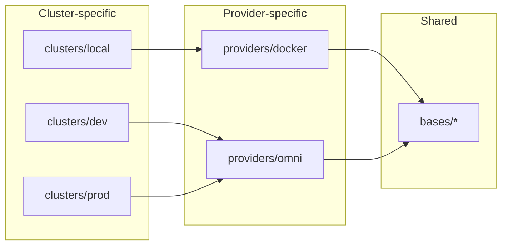
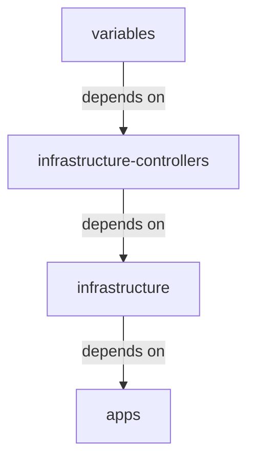

# DevantlerTech Platform ☸️⛴️


This repo contains the deployment artifacts for the DevantlerTech Platform. The platform is a Kubernetes cluster that is highly automated with the use of Flux GitOps, CI/CD with Automated Testing, and much more. Feel free to look around. You might find some inspiration 🙌🏻

## Prerequisites

For local development:

- [Docker](https://docs.docker.com/get-docker/) - For running the cluster locally.
- [KSail](https://github.com/devantler/ksail) - For developing the cluster locally, and for running the cluster in CI to ensure all changes are properly tested before being applied to the production cluster.

For the production cluster:

- [Talos Omni](https://www.siderolabs.com/platform/saas-for-kubernetes/) - For provisioning the production cluster, and managing nodes, updates, and the Talos configuration.
- [Hetzner](https://www.hetzner.com/cloud/) - For hosting servers for control plane and worker nodes.
- [Cloudflare](https://www.cloudflare.com) - For etcd backups, DNS, and tunneling all traffic so my network stays private.
- [Flux GitOps](https://fluxcd.io) - For managing the kubernetes applications and infrastructure declaratively.
- [SOPS](https://getsops.io) and [Age](https://github.com/FiloSottile/age) - For encrypting secrets at rest, allowing me to store them in this repository with confidence.

## Usage

> [!IMPORTANT]
> This setup uses SOPS to encrypt secrets at rest. If you want to run the platform locally, or on your own Omni instance, you will need to:
>
> 1. Fork this repo
> 2. Create your own Age keys
> 3. Update the `.sops.yaml` file in the root of the repository.
> 4. Update GitHub secrets with your Age key.
> 5. Replace all encoded `*.sops.yaml` files in the `k8s/` folder with new ones that are encrypted with your own keys.

To run this cluster locally, simply run:

```bash
ksail cluster create
ksail workload push
ksail workload reconcile
```

Once the cluster is running, expose Traefik on localhost with:

```bash
kubectl port-forward svc/traefik -n traefik 443:443 80:80
```

Then access services at `https://platform.lan` (requires host entries from the `hosts` file).

To tear down:

```bash
ksail cluster delete
```

## Clusters

> [!TIP]
> All clusters allow scheduling of workloads on control plane nodes. For homelab purposes, this is fine, but for enterprise use, it is recommended to separate control plane and worker nodes to ensure high availability and reliability.

### Production

Cloud cluster running on Hetzner Cloud. Used for production workloads.

#### Nodes

- 3x [Hetzner CX23 nodes](https://www.hetzner.com/cloud/) (x86 2 vCPU 4Gb RAM 40Gb SSD, eu-central)

## Hardware

- 3x [Hetzner CX23](https://www.hetzner.com/cloud/) (x86 2 vCPU 4Gb RAM 40Gb SSD)

## Structure

The cluster uses Flux GitOps to reconcile the state of the cluster with the single source of truth stored in this repository and published as an OCI image. KSail is used for local development, CI/CD testing, and production deployments. For production, nodes are provisioned on Hetzner Cloud and managed by Talos Omni.

All environments use the Talos Kubernetes distribution. Local development and CI use Talos with the Docker provider (via KSail), while production uses Talos with Omni on Hetzner Cloud.

The cluster configuration is stored in the `k8s/*` directories where the structure is as follows:

- [`clusters/`](k8s/clusters): Contains the the cluster specific configuration for each environment.
  - [`local`](k8s/clusters/local): Contains the local cluster specific configuration.
  - [`prod`](k8s/clusters/prod): Contains the production cluster specific configuration.
- [`providers/`](k8s/providers): Contains the provider specific configuration.
  - [`docker`](k8s/providers/docker): Contains the Talos+Docker specific configuration for local development.
  - [`omni`](k8s/providers/omni): Contains the Talos+Omni specific configuration for production.
- [`bases/`](k8s/bases): Contains the different bases that are used for the different clusters and providers.
  - [`infrastructure`](k8s/bases/infrastructure): Contains the different infrastructure components that are used for the different clusters and providers.
  - [`apps`](k8s/bases/apps): Contains the different apps that are used for the different clusters and providers.

### Kustomize and Flux Kustomization Flow

> [!IMPORTANT]
> If you know of a different way to manage kustomize and flux kustomizations that results in less boilerplate code, please let me know. I am always looking for ways to improve the structure and make it more maintainable.

To support hooking into the kustomize flow for adding or modifying resources for a specific cluster, a specific provider, or shared across all clusters, the following structure is used:

#### Kustomize Overlay Flow

Each cluster environment references a provider overlay, which in turn patches the shared base resources:


```mermaid
graph LR
  subgraph "Cluster-specific"
    local["clusters/local"]
    dev["clusters/dev"]
    prod["clusters/prod"]
  end

  subgraph "Provider-specific"
    docker["providers/docker"]
    omni["providers/omni"]
  end

  subgraph "Shared"
    bases["bases/*"]
  end

  local --> docker
  dev --> omni
  prod --> omni
  docker --> bases
  omni --> bases
```

#### Flux Kustomization Dependency Chain

Flux Kustomizations are reconciled sequentially. Each layer waits for the previous to become ready:


```mermaid
graph TB
  variables["variables"]
  controllers["infrastructure-controllers"]
  infra["infrastructure"]
  apps["apps"]

  variables -- "depends on" --> controllers
  controllers -- "depends on" --> infra
  infra -- "depends on" --> apps
```

This means that for every flux kustomization that is applied to the cluster, there should be a corresponding resource folder in `clusters/<cluster-name>/`, `providers/<provider-name>`, or `bases/` that contains resources that should be applied to the cluster for that flux kustomization at the specific scope. For example, for the following flux kustomization `k8s/clusters/<cluster-name>/infrastructure.yaml`, the following resource folders should exist:

- `k8s/clusters/<cluster-name>/infrastructure/`
- `k8s/providers/<provider-name>/infrastructure/`
- `k8s/bases/infrastructure/`

This allows for a clean separation of concerns and allows for modification of the resources for a specific cluster, provider, or shared across all clusters.

## Monthly Cost

| Item               | No. | Per unit | Total in Actual | Total in $ |
| ------------------ | --- | -------- | --------------- | ---------- |
| Talos Omni         | 1   | $10      | $10             | $10        |
| Cloudflare Domains | 3   | $0,87    | $2,61           | $2,61      |
| Hetzner CX23       | 3   | €4,51    | €13,53          | $15,36     |
| Total              |     |          |                 | $27,97     |

## Star History

[](https://star-history.com/#devantler/homelab&Date)
